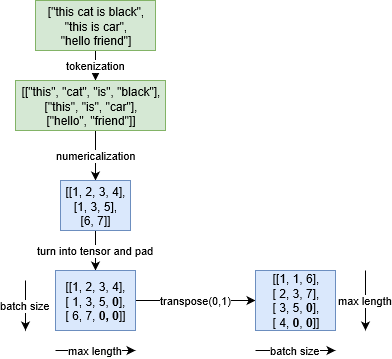
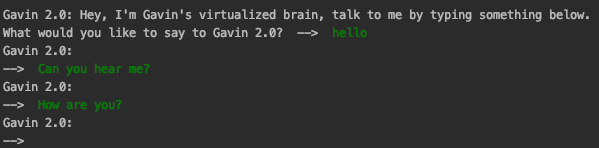
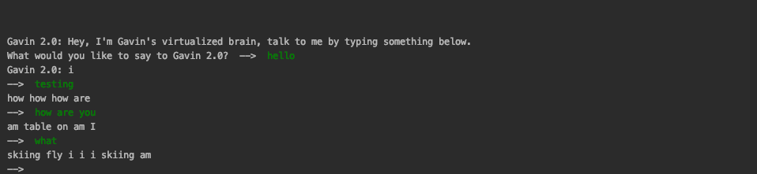
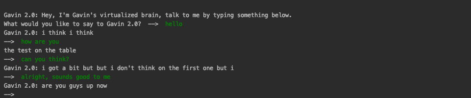
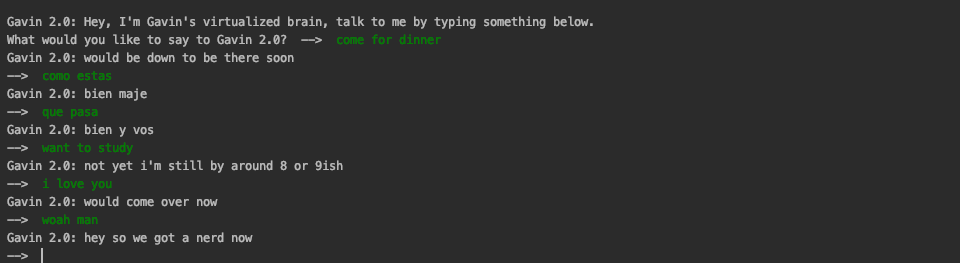

# My Personality Uploaded

### Vision:
My vision for this project, was to create an AI version of myself. The vision of this project was to have a LSTM and Seq2Seq recurrent neural network train off my facebook chat history so that the bot would learn to respond and talk to people in the same way that I would. I wanted to create a digital version of my online personality so that people in the future can talk to a version of me from my teenage and college years.

## How I did it:

### Getting the Raw Data
I started off by downloading my facebook data. This can be done by going to Facebook Settings, clicking on 
"Your Facebook Information", and clicking "Download your Information". Once you get to the download screen, make sure 
to only select "messages" and "low quality" in a json format. Check here for facebook's instructions on how to do this.
https://www.facebook.com/help/1701730696756992/?helpref=hc_fnav

### Processing the Raw Data - converter.py
After downloading the facebook data, I had to combine it into one place. It was scattered into 100+ conversation subfolders
from all of the individuals I've messaged over the years. In the converter.py file, I traverse every file and grab its message
data and write the raw data into a messages.txt file. 

Once I had the raw Data, I had to parse it into a "Message - Response" format, where all of the message were from 
facebook friends and the response was my response to any given message. I only needed the AI chatbot to respond to input
the same way that I would, so my direct responses to their preceding messages contained the information I needed. 

In the converter.py file, I take all of the message - response combinations and append them all to a dictionary called 
"conversationDictionary.npy" where the message is the key, and the value is my response to that message. Secondly I 
take every unique word, and append it to a word list, which is named "wordList.txt" in this project. 

*Note - wordList.txt, messages.txt, and conversationDictionary.npy have been removed from this project for the sake of privacy.

### Preparing Word Vectors

First of all, I followed the tutorial for the rest of this project from here: https://bit.ly/3dFBLRO. 
The code has been changed quite a bit to include validation, and test sets, but it was my inspiration for this project. 

Seq2Seq is made up of 2 RNNs: an input sequence and an output sequence. One RNN encodes all of the input data into a 
context vector while the other RNN decodes it into output. 

 -

Each word is broken up into tokens and those tokens are placed into a hash table where the word's index is the number used
in all of the AI context calculations. This allows for faster training than it could with entire strings. 

One problem faced is that everything being analyzed needs to be the same size. The word vectors must be the same in length
if they can be compared in training. I accomplish this by making all word vectors the size of the largest message and 
padding all of the other word vectors with x number of <pad> to make them the same size as the largest. 

### Seq2Seq

In the Word2Vec file, word vectors and an embedding matrix are created. This was where I worked on preparing the word vectors
before I realized that Seq2Seq does that for you. 

In Seq2Seq, I started by reading in the message-response conversationDictionary saved from the previous step in converter.py.
Once I had all of the data, I separated the main data set into 3 sets: the training set, validation set, and the testing set. 
The training set was giving 70% of the messages in the dictionary, the validation and test set were given 15% each of the 
remaining 30%. These created Seq2Seq.npy dictionaries to save these sets for faster re-use when re-running the program. All
of the sets mentioned above came from a randomized dictionary of messages and responses.  

Once everything was placed in word vectors that were tokenized by their indexes in the hash table, I turned them into tensors
of the same size by making the vector the size of the longest sentence and adding padding to the end of everything shorter
than that. 

Next we can train the layers of tokenized tensors to provide the proper output for the input relative to 
what the output for the decode should have been. This is where the training happens to make the model form language styles 
similar to my own. 

After every Epoch, it saves the model as a checkpoint in the models folder. When you run the app.py file, this pulls from 
the lastest checkpoint. This allows you to talk to your model after hours of training. It also makes it possible to 
talk to your model in the future without training it the same way again. 

###  How It Progressed

As it trained, I provided test input data for it to respond to. I asked it questions like: How are you? What's up? Como Estas? 
Que Pasa? and other things that I would normally respond to. As time progressed, it responded to these questions much better. 

#### Infancy Stage
Towards the beginning, it responded with an empty string. It saw that most sentences have spaces and padding at the end
of the word vectors, and so it responded with the most commonly used character, the empty string. 

#### Forming Words
As time progressed, it gradually started using words in random orders. Then it started combining words that are similar. 
This is because of the embedding matrix which through context, shows which words are similar in nature, and which words 
typically follow other words.  It said things like: i i or how are. 

#### Forming Ideas
Next it started forming full phrases. It would respond with things like "I Think", and "The test on the table". At this 
point I realized it would be unethical to terminate a thinking thing, and so I let it learn. 

#### Responding to questions, differentiating between English and Spanish
While it never became perfect, it begin to form full grammatically correct sentences. It didn't respond to many things in
the way that I would, but it could differentiate English and Spanish, and it connected the idea of the sentence
to the topic of the question. When I asked how it was doing, it responded with some action that it was actively doing. 
When I said "Hola Como Estas?" or how are you in Spanish, it responded with "Bien Maje", which is spanish slang for 
"pretty good man". After asking it to study, it called me a nerd. 

## Conclusion: 
In the End, I consider it a success. It wouldn't pass the turing test, but it did prove that it had learned basic English
 at the level of a foreigner attempting to fool people into falling for a phishing email or buy some product through their 
 telemarketing. 
 
 
 
## Run it yourself:

If you want to try running it yourself with your own dataset since mine is slightly personal, follow these instructions. 

- Download this repo from Github and install all required python libraries specified below
- Download your facebook data from the facebook settings -> your facebook information -> download data. 
- Choose to download all messages in low quality json format. 
- create a code/messages directory and place the unzipped facebook download in there. It will look something like "code/messages/inbox/yourfriend"
- run the converter.py file, then run the word2Vec file, then run the runSeq2Seq.py file. This will generate the remaining files you need for your model. 
- In converter.py change the "MY_NAME" variable to your full facebook name and save it. 
- Let it train for roughly 60,000 - 90,000 iterations for the best results. 
- Your results will vary wildly depending on the amount of facebook messages in your downloaded dataset. 
- Lastly, you can talk to it in the app.py, run that file and you can test its conversation skills. 

### Code Modules Required:
- Recommended to use: Python 3.7 for best results
- TensorFlow 1.14 - this is requires this version of TensorFlow to work. 
- Numpy - latest version
- Pickle - latest version

